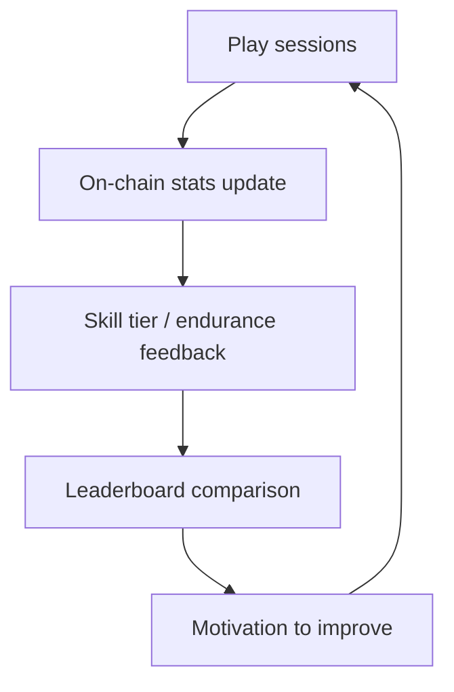
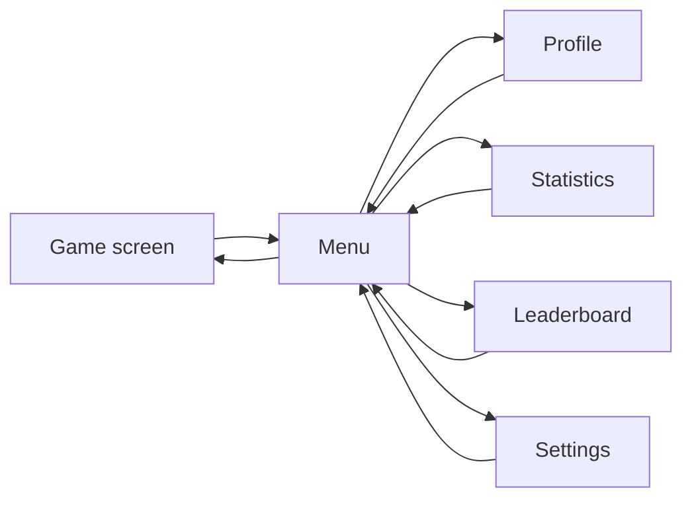

# UX — Insomnia Game (Full Master Document)

This document is the **full UX reference** for **Insomnia Game**: user goals, friction reduction, flows, feedback, decision points, progression, learning, responsiveness, accessibility, trust, error recovery, edge cases, and scope. It is intentionally **exhaustive** so it can later be trimmed into portfolio summaries or stakeholder one‑pagers without losing the source-of-truth reasoning.

- For **UI system and component implementation**, see `Docs/UI_INSOMNIA_GAME.md` (to be authored).
- For **portfolio narrative and talking points**, see `Docs/PORTFOLIO_INSOMNIA_GAME.md` (to be authored).

---

## 0. Product snapshot (what the experience is)

### 0.1 One-line description

**Insomnia Game is a fast-paced clicker/reflex endurance game on a 5×5 grid** with progressive difficulty and a freemium Web3 layer (Sui wallet, GamePass credits, on-chain stats, leaderboards).

### 0.2 The experience pillars (UX north stars)

- **Low-friction entry**: anyone can try immediately (demo) and understand the loop in seconds.
- **Skill clarity**: performance signals are legible (score/time/clicks/efficiency + difficulty level).
- **Fairness and trust**: when blockchain is involved, users understand what is stored/submitted and when.
- **Mobile-first usability**: touch-friendly targets, stable layout, PWA-friendly behavior.
- **Accessibility-first**: full keyboard navigation + screen reader support as a first-class requirement (claimed WCAG 2.1 AA in project docs).

---

## 1. Glossary and canonical terms (avoid copy drift)

### 1.1 Canonical terms

- **Session**: a single play instance from “Start Game” to Game Over.
- **Round / block**: one spawned target tile that must be clicked in time (after the first).
- **First block**: the initial block shown after pressing Start Game; **no timeout** until clicked.
- **Active play**: state after the first block is clicked; timeouts and wrong-click rules apply.
- **Wrong click**: clicking a non-target tile; ends the game **only after active play starts**.
- **Timeout**: failing to click the target block before it disappears; ends the game.
- **Difficulty level**: named band for speed progression (Beginner → Intermediate → Advanced → Expert → Master).
- **Speed**: target visibility time (e.g., 1.0s → 0.8s → 0.6s → 0.4s → 0.3s minimum).
- **Demo**: free play mode without wallet; no on-chain persistence.
- **Premium**: wallet-connected mode with GamePass credits and on-chain persistence.
- **GamePass**: NFT-based access that provides **credits** (games remaining).
- **Credit**: one premium session entitlement consumed when starting premium play (defined below).

### 1.2 Canonical UI labels (recommended)

These are the UX-canonical labels to keep terminology consistent across modals/buttons:

- Primary CTA: **Start Game**
- Wallet CTA: **Connect Sui Wallet**
- Upgrade CTA: **Upgrade** (or “Buy GamePass”)
- Add credits CTA: **Add Games**
- Global navigation: **Menu**
- Menu items: **Profile**, **Statistics**, **Leaderboard**, **Settings**
- Game Over CTA: **Play Again**

---

## 2. User goals and outcomes

### 2.1 Primary user goals

We design for players who want to:

1. **Start playing instantly** (no setup friction).
2. **Understand the rule set quickly** (what counts as a miss, what ends a game).
3. **Track improvement** (personal bests, averages, skill tiers).
4. **Compete** (global leaderboard, multiple ranking categories).
5. **Customize the experience** (themes, settings, accessibility).

### 2.2 Outcomes we enable (user promises)

- **“I can try the game without committing.”**
  - Demo mode works without a wallet.
  - The first block has no timeout so users can orient themselves.

- **“When I’m ready to go fast, the rules are fair and consistent.”**
  - Wrong clicks are safe before active play begins.
  - After active play begins, wrong click and timeout rules are strict and consistent.

- **“I always know how hard the game is right now.”**
  - Speed and level indicators reflect real-time difficulty.
  - The 30-second difficulty step is communicated through UI.

- **“Premium is worth it and doesn’t feel risky.”**
  - Wallet connection is intentional (no unwanted auto-connect).
  - Credits are visible and consumption is understandable.
  - Score submission and persistence are transparent with clear feedback.

---

## 3. Core loops and experience map

### 3.1 Core gameplay loop (demo or premium)

```mermaid
flowchart TD
  A[Landing / Game screen] --> B{Wallet connected?}
  B -->|No| C[Demo path]
  B -->|Yes| D{Has credits?}
  C --> E[Choose Theme + Start Game]
  D -->|No| F[Upgrade / Buy pass / Add games]
  D -->|Yes| E
  E --> G[First block appears (no timeout)]
  G --> H[Click first block -> Active play starts]
  H --> I[Timed blocks spawn]
  I --> J{Miss condition?}
  J -->|Wrong click or timeout| K[Game Over modal]
  J -->|No| I
  K --> L{Premium?}
  L -->|Yes| M[Submit score + update stats + leaderboard]
  L -->|No| N[Local summary only]
  M --> O[Play Again / Back to Menu]
  N --> O
```

### 3.2 Progression loop (premium)



### 3.3 Navigation loop (global header menu)



---

## 4. Friction reduction (what we optimized and why)

### 4.1 “First block stays visible” (gentle onboarding)

**Problem**: A reflex game can feel punishing if the very first interaction is timed.

**Solution**: The first block appears with **no timeout** until clicked; wrong clicks do nothing before the game starts.

**Why it matters**

- Lets first-time users orient to the grid and rules without anxiety.
- Prevents “instant fail” experiences that reduce retention.

**Acceptance criteria**

- Before active play begins:
  - Wrong clicks do not end the game.
  - The first block remains visible indefinitely.

### 4.2 Progressive difficulty with clear thresholds

**Problem**: Difficulty increases can feel arbitrary without clear cues.

**Solution**: Speed steps every **30 seconds** and is mirrored by UI indicators (speed + level).

**Acceptance criteria**

- At each 30-second threshold, the UI updates the level name and speed time.
- Minimum speed floor is enforced (0.3s).

### 4.3 Premium without “surprise wallet behavior”

**Problem**: Auto-connecting wallets or forcing connections on first visit creates distrust.

**Solution**: Wallet connection is manual; reconnection is intelligent only after the user has previously connected.

**Acceptance criteria**

- First visit does not auto-connect.
- After a user manually connects, a refresh restores connection state (development fast refresh is also supported per project docs).

### 4.4 Credits system: fast replay without repeated friction

**Problem**: If premium play requires complex steps every session, the loop breaks.

**Solution**: Credits are visible; consumption is automatic at the start boundary (see §6.2 for the spec).

**Acceptance criteria**

- Premium player can go from Game Over → Play Again → active play with no more than one optional interstitial (e.g., if a blocking message is required).

---

## 5. First-time vs returning experience

### 5.1 First-time (no wallet) — ideal path

**Intent**: “Try in seconds” and teach rules through play.

1. Landing shows clear CTAs (Demo play is available; premium requires wallet).
2. User chooses a theme (optional but encouraged).
3. Start Game → first block appears (no timeout).
4. User clicks first block → active play begins → difficulty ramps.
5. Game Over modal explains outcome and offers Play Again.

**UX requirements**

- Demo path must never dead-end into wallet prompts mid-session.
- Game Over summary must be readable on mobile and explain how to improve.

### 5.2 Returning (premium) — ideal path

**Intent**: “Fast repeat loop” with visible premium status.

- Wallet already connected.
- Credits visible (global header / profile).
- Start Game is immediate.
- Game Over triggers score submission feedback and stat updates.

**UX requirements**

- Premium status and remaining credits must be easy to find in one place (header/profile).
- Submission feedback must be explicit (success/failure + retry guidance).

---

## 6. Decision points (clarity specs)

### 6.1 “Can I start right now?”

**Signals**

- Wallet state is visible (connected vs not).
- Premium button states are contextual (Play Premium vs Connect Wallet).

**Acceptance criteria**

- A user can answer “Can I play premium right now?” without opening more than one modal.

### 6.2 “Will this consume a credit?”

This is where trust is won or lost.

**Recommended rule (align UI + copy to one truth)**

- If the game consumes credits **when Start Game is clicked**, then:
  - The Start Game action must communicate this before activation.
- If the game consumes credits **when the first block is clicked** (as stated in project status docs), then:
  - The UI should explain: “Credit is used when you start playing (first click).”

**Acceptance criteria**

- The credit consumption boundary is documented in UI copy and matches actual behavior.
- Users do not lose credits by accidentally opening the game and leaving before active play begins (if consumption occurs on first block click).

### 6.3 “What ended my game?”

**Signals**

- Game Over modal states whether it was:
  - a **timeout**, or
  - a **wrong click** (after active play began).

**Acceptance criteria**

- Game Over reason is explicit.
- Recommended improvement tip matches the failure reason.

### 6.4 “How hard is it right now?”

**Signals**

- Speed card shows current visibility time.
- Level card shows difficulty name.

**Acceptance criteria**

- Speed + level update within one render frame of the threshold event (perceived immediate).

### 6.5 “Where do I see my progress?”

**Signals**

- Statistics modal shows personal best, averages, games played, endurance metrics.
- Leaderboard modal shows ranks and categories; “how rankings work” content is accessible.

---

## 7. Feedback and trust (success, error, loading)

### 7.1 Success feedback

- Clear visual feedback on correct clicks (e.g., green flash).
- Score increments are immediate.
- Difficulty transitions are reinforced by updated speed/level UI.

### 7.2 Failure feedback

- Wrong click ends the game only after start; before start it is safe.
- Timeout is clearly communicated (not “random loss”).

### 7.3 Blockchain action feedback (premium)

**Requirements**

- Score submission has:
  - loading state (if it takes noticeable time),
  - success confirmation,
  - error message with a next step (retry or “saved locally; try again later” depending on design).

**Acceptance criteria**

- Users are never left wondering whether a score “counted.”

---

## 8. Progression and motivation

### 8.1 Personal mastery signals

- PB score/time/clicks/efficiency.
- Skill tier and endurance level.
- “Performance tips” section gives actionable advice (keep concise and specific).

### 8.2 Social/competitive motivation

- Leaderboard categories allow different definitions of “best.”
- Tier filtering supports fair comparison among peers.

### 8.3 Fairness perceptions (anti-cheat posture)

Even without detailing the implementation, UX should communicate:

- What is measured.
- Why rankings are meaningful.
- Any constraints (e.g., only premium sessions count).

---

## 9. Learnability and cognitive load

### 9.1 Rules users must learn (minimum viable mental model)

Within the first 30 seconds, users should understand:

- Click the highlighted block.
- After the first click, blocks are timed.
- Wrong clicks after starting end the game.
- Speed increases every 30 seconds.

### 9.2 How we teach without heavy tutorials

- First block safety (no timeout) is the onboarding tool.
- UI indicators (speed/level) teach progression implicitly.
- Game Over modal gives targeted feedback (“you timed out” vs “wrong tile”).

---

## 10. Responsive and input UX

### 10.1 Mobile-first constraints

- 5×5 grid must stay tappable.
- Touch targets meet a minimum size (project docs cite 44px).
- Safe-area (notch) handling prevents UI from being clipped.

### 10.2 Desktop and keyboard

- Full keyboard navigation (claimed) requires:
  - reachable Start Game, theme selection, and menu items,
  - logical tab order,
  - visible focus states,
  - escape-to-close for modals,
  - screen-reader labels for controls and modal titles.

### 10.3 PWA considerations

- Offline behavior must not produce silent failures.
- If offline prevents premium submission, the UX should:
  - notify the user,
  - avoid data loss where possible.

---

## 11. Accessibility and inclusion (full scope statement)

Project docs claim **WCAG 2.1 AA** compliance. This UX document defines the UX expectations for that:

### 11.1 Accessibility requirements (UX-level)

- **A11Y-1**: All interactive controls have accessible names (visible label or ARIA label).
- **A11Y-2**: Modals trap focus while open and return focus on close.
- **A11Y-3**: All controls are usable by keyboard only.
- **A11Y-4**: Status changes that matter (game over, submission result) are announced to assistive tech.
- **A11Y-5**: Color is not the only carrier of meaning (e.g., “active block” has shape/animation cues, not only hue).
- **A11Y-6**: Text contrast meets AA (documented/verified in audit materials; ensure UX copy doesn’t contradict).

### 11.2 What we do not cover here

- A full WCAG checklist and evidence belongs in `COMPREHENSIVE_AUDIT_REPORT.md`.

---

## 12. Edge cases and recovery

### 12.1 Wallet disconnected mid-use

- Premium actions requiring wallet should gracefully degrade with a clear reconnect CTA.
- Read-only surfaces (e.g., cached stats) can still display where possible.

### 12.2 Score submission failure

- Provide retry option.
- Explain whether local results are preserved.

### 12.3 No credits

- Premium play CTA should route to Upgrade/Add Games flow.
- The UI must clearly explain what a credit is and how many are required per session.

### 12.4 Empty leaderboard / API error

- Show explicit empty/error state and provide refresh.

### 12.5 Device rotation / small screens

- Keep grid usable; avoid layout shifts that change tap targets unexpectedly during a session.

---

## 13. Tradeoffs (intentional UX choices)

### 13.1 Gentle start vs strict immediacy

First block safety improves onboarding but can reduce “instant challenge.” We chose onboarding clarity over harsh first-contact difficulty.

### 13.2 Multi-metric leaderboards vs single score

Multiple categories increase complexity but broaden what “success” means and reduce “one meta” dominance.

### 13.3 Premium persistence vs friction

Wallet persistence must not become auto-connect; we prioritize user control even if it adds one click initially.

---

## 14. Appendix — UX acceptance checklist (quick test list)

### 14.1 Session start checklist

- [ ] Demo can start without wallet.
- [ ] First block has no timeout.
- [ ] Wrong clicks do nothing before active play.
- [ ] Clear signal when active play begins.

### 14.2 Difficulty checklist

- [ ] Speed changes every 30s.
- [ ] UI reflects speed + level immediately.
- [ ] Minimum speed is enforced.

### 14.3 Premium + blockchain checklist

- [ ] Wallet connection is manual on first visit.
- [ ] Credits are visible and understandable.
- [ ] Credit consumption boundary matches UX copy.
- [ ] Score submission shows loading + success/error feedback.

### 14.4 Accessibility checklist (UX-facing)

- [ ] Keyboard navigation works end-to-end.
- [ ] Focus is visible and managed in modals.
- [ ] Screen reader labels exist for controls and modal titles.

---

*This is the master UX document for Insomnia Game. It is long by design; it exists to be the source of truth.*

